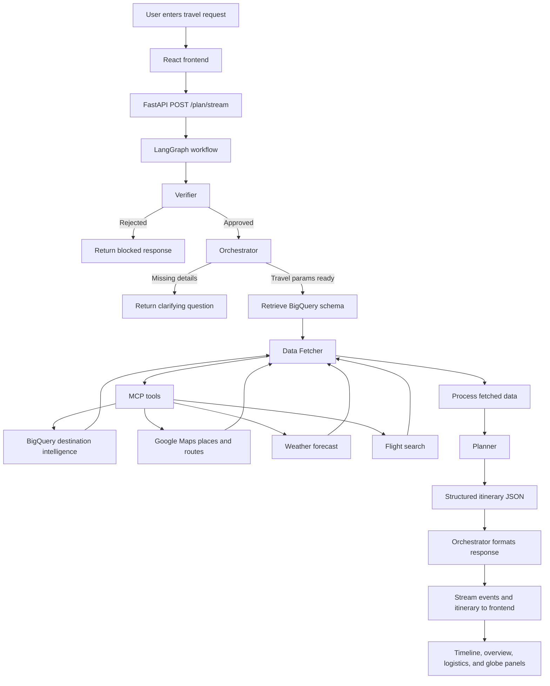
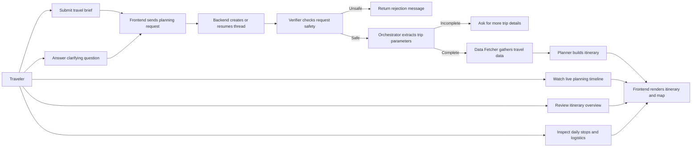

# A2A Travel Planner

Multi-agent travel planning with CaMeL-style security checks, MCP-based data fetching, and a React frontend for live itinerary generation.

## Technologies Used

### Backend

- Python 3.11 for the core application runtime
- FastAPI for REST and streaming API endpoints
- Uvicorn as the ASGI server
- Pydantic and pydantic-settings for request models, itinerary schemas, and environment config
- httpx for HTTP integrations
- Rich for CLI-friendly output

### AI and Agent Orchestration

- LangGraph to build the multi-step verifier -> orchestrator -> data fetcher -> planner workflow
- LangChain Core for message handling and tool-call abstractions
- Google Gemini via `langchain-google-genai` for verifier, orchestrator, data fetcher, and planner reasoning
- CaMeL-style guardrails for prompt-injection and query-safety checks

### Data and External Integrations

- MCP Toolbox via `toolbox-core` for tool execution
- Google BigQuery for destination intelligence and schema retrieval
- Google Maps APIs for places and route-related travel data
- OpenWeatherMap for forecast data
- SerpApi for Google Flights and Google Hotels data

### Frontend

- React 18 for the client UI
- Vite for frontend development and bundling
- Native Fetch + streamed response parsing for POST-based SSE handling

### Dev and Deployment

- Poetry for Python project metadata and dependency management
- pytest and pytest-asyncio for test support
- Docker for containerized backend deployment

## Process Flow Diagram



## Use Case Flow Diagram



## Quick Start

### 1. Install

```bash
cd the_project
pip install -r requirements.txt
```

### 2. Configure Environment

```bash
cp .env.example .env
```

Edit `.env` and fill in:

- `GOOGLE_API_KEY` - Gemini API key (required)
- `GOOGLE_CLOUD_PROJECT` - GCP project id for BigQuery and MCP sources
- `GOOGLE_MAPS_API_KEY` - Places + Routes + browser map key
- `OPENWEATHERMAP_API_KEY` - weather forecast key
- `SERPAPI_API_KEY` - SerpApi key for Google Flights and Google Hotels
- `BQ_SOURCE_DATASET` - BigQuery dataset, usually `your-project.travel_intelligence`
- `MCP_TOOLBOX_URI` - keep `http://127.0.0.1:5000` for local and in-container MCP
- `MCP_TOOLBOX_PORT` - defaults to `5000`

### 3. Authenticate with Google Cloud

```bash
gcloud auth application-default login
```

### 4. Start MCP Toolbox Server

Download [GenAI Toolbox](https://github.com/googleapis/genai-toolbox/releases), then:

```bash
python start_mcp.py
```

### 5. Run the CLI Agent

```bash
python -m agent.cli
```

### 6. Run the API Server

```bash
uvicorn backend.main:app --reload --port 8000
```

### 7. Run the Frontend

```bash
cd frontend
npm install
npm run dev
```

## Cloud Run Deployment

This repo is prepared for a single-container Cloud Run deployment:

- the React frontend is built into `frontend/dist`
- FastAPI serves both the API and the built frontend
- the MCP toolbox runs inside the same container on `127.0.0.1:5000`

Deployment files:

- `Dockerfile`
- `start_cloud_run.sh`
- `.dockerignore`
- `cloudbuild.yaml`

Required runtime env vars:

- `GOOGLE_API_KEY`
- `GOOGLE_CLOUD_PROJECT`
- `GOOGLE_CLOUD_LOCATION`
- `GOOGLE_CLOUD_REGION`
- `GOOGLE_MAPS_API_KEY`
- `OPENWEATHERMAP_API_KEY`
- `SERPAPI_API_KEY`
- `BQ_SOURCE_DATASET`
- `MCP_TOOLBOX_URI=http://127.0.0.1:5000`
- `MCP_TOOLBOX_PORT=5000`

Build and deploy:

```bash
gcloud builds submit --config cloudbuild.yaml .

gcloud run deploy a2a-travel-planner \
  --image gcr.io/YOUR_PROJECT_ID/a2a-travel-planner:YOUR_IMAGE_TAG \
  --region us-central1 \
  --platform managed \
  --allow-unauthenticated \
  --set-env-vars MCP_TOOLBOX_URI=http://127.0.0.1:5000,MCP_TOOLBOX_PORT=5000
```

Notes:

- Cloud Run injects `PORT`; the container now uses it automatically.
- BigQuery auth should come from the Cloud Run service account.
- If you want frontend requests to hit the same deployed origin, leave `VITE_API_BASE_URL` unset when building.
- Restart and redeploy after changing MCP tool definitions in `mcp_server/tools.yaml`.

Suggested Cloud Run secret/env setup:

- plain env vars:
  - `GOOGLE_CLOUD_PROJECT`
  - `GOOGLE_CLOUD_LOCATION`
  - `GOOGLE_CLOUD_REGION`
  - `BQ_SOURCE_DATASET`
  - `MCP_TOOLBOX_URI`
  - `MCP_TOOLBOX_PORT`
- secrets:
  - `GOOGLE_API_KEY`
  - `GOOGLE_MAPS_API_KEY`
  - `OPENWEATHERMAP_API_KEY`
  - `SERPAPI_API_KEY`

## API Endpoints

| Method | Endpoint | Description |
|--------|----------|-------------|
| GET | `/health` | Health check |
| POST | `/plan` | Plan a trip and return the full result |
| POST | `/plan/stream` | Plan a trip with streamed agent events |
| GET | `/itinerary/{id}` | Retrieve a saved itinerary |

## Project Structure

```text
the_project/
|-- agent/                    # LangGraph multi-agent workflow
|   |-- agents/               # Orchestrator, planner, and data fetcher
|   |-- config.py             # Environment-driven settings
|   |-- guardrails.py         # CaMeL-style safety checks
|   |-- graph.py              # Graph construction and routing
|   |-- itinerary.py          # Structured itinerary schema
|   |-- nodes.py              # Node functions and routing logic
|   `-- cli.py                # Interactive CLI entry point
|-- backend/
|   `-- main.py               # FastAPI REST and SSE server
|-- frontend/
|   `-- src/                  # React UI and stream rendering
|-- mcp_server/
|   `-- tools.yaml            # MCP tool configuration
|-- start_mcp.py              # MCP server launcher
|-- start_cloud_run.sh        # Cloud Run startup script
|-- setup_bq.py               # BigQuery setup helper
|-- cloudbuild.yaml           # Cloud Build pipeline
|-- requirements.txt
|-- pyproject.toml
`-- Dockerfile
```

## Security

1. Static pre-screening in `agent/guardrails.py` blocks suspicious prompt patterns.
2. The verifier node performs LLM-based intent validation before planning continues.
3. Query guardrails are designed to reduce unsafe or expensive data access patterns.
